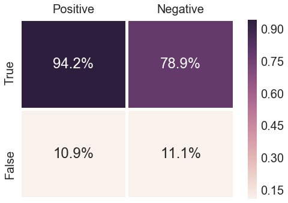

# Project 3: Deliverable II

[Project Description](https://www.cs.usfca.edu/~mmalensek/courses/cs686/projects/project-3.html)

---

# [Sentiment analysis and classification of user reviews.](https://github.com/cs686-bigdata/p3-d2-bluedragonz/blob/master/User%20Review%20Analysis.ipynb)
Using Spark's ML package, we created a classification model that identifies reviews as positive or negative based on their content. To preprocess the reviews, the model first tokenizes the text into vectors of words and filters out unimportant, common words (i.e. "the", "that", "and"). It then creates a vector for each review that holds a frequency of each word in the training data. For example, if "yummy" was seen 302 times in the training data, it would be represented by 302 in the vector. Typically, less common words in a text corpus are the terms that carry the meaning and sentiment behind a sentence. Thus, the model then assigns lower weight to words that have higher frequency, and higher weight to those with lower frequency, following the concept of [*Term Frequency - Inverse Document Frequency*](https://en.wikipedia.org/wiki/Tf%E2%80%93idf) (TF-IDF). For classification, the model uses logistic regression with elastic net regularization. 

*Additional Data Info:*
- Total Number of Reviews: 4,736,897
- Number of Training Reviews: 2,842,323 (60%)
- Number of Validation Reviews: 1,420,849 (30%)
- Number of Test Reviews: 473,725 (10%)
- Since the model uses supervised learning, each review is pre-labeled as positive/negative based on the number of stars given by a user: 
    + **positive:** stars > 3
    + **negative:** stars <= 3

### Results: 
After tuning regularization parameters, the model performed with 89% accuracy on the test dataset. 

From the confusion matrix above, we can see that the model identified 94.2% of all positive reviews in the test data correctly, and 78.9% of negative reviews correctly.

 

Here's an example of a review classified as **positive**:

*"Matts feels like home. The tables remind me of snack time in Grandma's kitchen, the salt and pepper shakers remind me of the ones that sat on my neighbor's counter in her collections.... even the slightly wobbly leg of the chair reminds me of my college apartment furnished with family castaways and thrift shop treasures. \n\nREAL food comes from a place that feels so much like home... by real, i mean... real eggs, real butter, real sausage.... \n\nFood at Matt's is pure and innocent... Pancakes with butter. Eggs with potatoes and bacon. Classic. \n\nyum."*

 

Here's an example of a review classified as **negative**: 

*"This place has received a lot of hype, so be prepared to wait.\nand wait.\nand wait.\n\nTo make the trip more enjoyable:\n- don't actually come hungry (or risk passing out in the lot from low-blood sugar)\n- show up at least hour earlier than you want to be seated then get on list\n- go hang out  at the farmers market across street while you wait\n- expect solid (but not mind blowing) food\n\nGo for the experience at least once, then find another breakfast spot."*

